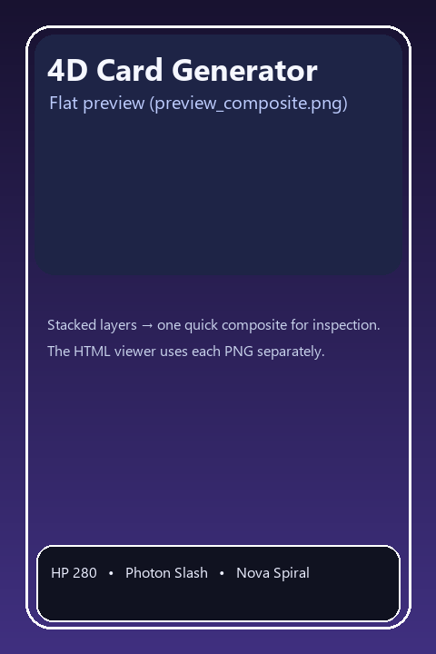
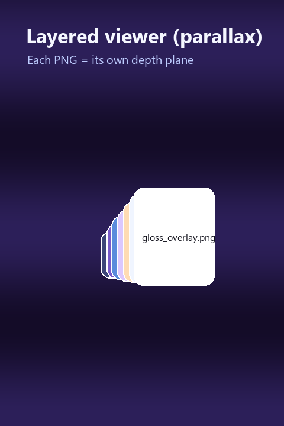
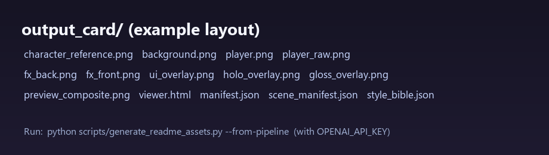

# 4D Card Generator


**Generate a collectible-style anime player card as separate PNG layers**, then drop them into the included **browser viewer** where each plane sits at its own Z depth and responds to pointer movement with **subtle, premium parallax**.

This is **not** a “single flat trading card JPEG” tool. The real product is **layered artwork** you can reuse in the web, **Three.js**, or a game engine.

> The **4D** feel comes from **multiple transparent layers moving at different depths**, not from one baked composite.

<p align="center">
  
  &nbsp;
  
</p>

<p align="center">
  
</p>

**Refresh these images:** with `OPENAI_API_KEY` set (or a project-root `.env` loaded by `python-dotenv`), run  
`python scripts/generate_readme_assets.py --from-pipeline`  
to regenerate assets from a real pipeline run. Without an API key, `python scripts/generate_readme_assets.py` writes deterministic Pillow marketing stills into the same folder.

---

## Features

- **Layered PNG export** — background, holo, back FX, player, front FX, UI, gloss (plus character reference and a flat preview).
- **Transparent player / FX** — designed for compositing and engines.
- **Deterministic overlays** — UI, holographic foil, and gloss are rendered locally with Pillow for clean type and repeatable chrome.
- **Built-in `viewer.html`** — loads **each layer as its own `` plane**; never uses `preview_composite.png` for the effect.
- **JSON manifests** — `manifest.json` + `scene_manifest.json` describe files, stack order, and depth hints.
- **JSON-driven cards** — theme, copy, stats, depth, parallax, and player fitting are configurable.
- **Engine-ready mindset** — same layer stack maps cleanly to quads, billboards, or UI canvases later.

---

## Why layered cards?

A single flattened render is fast to share, but it **locks depth away**. Separate layers let you:

- Parallax in 2.5D on the web (this repo’s default).
- Push Z offsets into a real 3D scene later.
- Tune holo / gloss / UI **without** re-prompting the image model.

---

## Visual stack (important)

Recommended composite order (back → front):

1. `background.png`
2. `holo_overlay.png`
3. `fx_back.png`
4. `player.png`
5. `fx_front.png`
6. `ui_overlay.png`
7. `gloss_overlay.png`

**Holo** supports the whole card; **back FX** stays behind the hero; **front FX** reads in front of the body; **UI** stays readable near the front; **gloss** is the finishing shine.

Default **Z depths** (tweak in `examples/sample_config.json` under `viewer_depths`):

| Layer      | Default Z |
|-----------|------------|
| background | −18 |
| holo       | −8 |
| fx_back    | 0 |
| player     | 10 |
| fx_front   | 16 |
| ui         | 22 |
| shine slot | 26 |

The viewer keeps spacing **controlled** so the player has depth but does not “explode” out of the stack.

---

## How it works (plain English)

1. **Style bible** — `gpt-5.4` via the Responses API returns structured prompts (`style_bible.json`).
2. **Character reference** — anchor portrait on transparent alpha.
3. **Background** — full plate, no character.
4. **Player** — hero on transparent alpha (`player_raw.png` → fitted `player.png`).
5. **FX layers** — separate back and front effect passes on alpha.
6. **Local overlays** — UI bars, holo field, gloss sheen (Pillow).
7. **Flat preview** — `preview_composite.png` for a quick composition check only.
8. **`viewer.html`** — injects depth + parallax config; loads individual PNGs.
9. **Manifests** — documents outputs and the recommended stack.

Identity consistency across **separate** image generations is **best-effort**. This pipeline improves it with a style bible + character reference + shared anchors; deterministic UI/holo/gloss avoids noisy text from the model.

---

## Installation

### macOS / Linux

```bash
git clone https://github.com/<you>/4d-card-generator.git
cd 4d-card-generator
python -m venv .venv
source .venv/bin/activate
pip install -r requirements.txt
```

### Windows (PowerShell)

```powershell
git clone https://github.com/<you>/4d-card-generator.git
cd 4d-card-generator
python -m venv .venv
.\.venv\Scripts\Activate.ps1
pip install -r requirements.txt
```

Optional editable install (adds the `generate-card` console script):

```bash
pip install -e .
```

---

## Environment setup

Create a key in the [OpenAI dashboard](https://platform.openai.com/). **Never commit it.**

```bash
export OPENAI_API_KEY="your_key_here"   # macOS / Linux
```

```powershell
$env:OPENAI_API_KEY = "your_key_here"   # Windows PowerShell
```

See `.env.example` for a template you can copy into a local `.env` and load with your own tooling if desired (this repo’s CLI reads the standard process environment).

---

## Usage

**Simplest run** (built-in demo config):

```bash
python generate_card.py
```

**Custom config**:

```bash
python generate_card.py --config examples/sample_config.json
```

**Custom output directory**:

```bash
python generate_card.py --config examples/sample_config.json --output ./runs/astra_01
```

**Regenerate only the HTML viewer + JSON manifests** (after hand-editing depths in your config):

```bash
python generate_card.py --config examples/sample_config.json --viewer-only
```

**Recompute deterministic overlays + flat preview** from existing layers (no API calls):

```bash
python generate_card.py --config examples/sample_config.json --rebuild-overlays
```

**Overwrite** an existing output folder that already contains `manifest.json`:

```bash
python generate_card.py --overwrite
```

---

## Output files

| File | Role |
|------|------|
| `character_reference.png` | Identity anchor (transparent). |
| `background.png` | Environment plate. |
| `player_raw.png` | Raw model output before fitting. |
| `player.png` | Cropped / scaled to sit nicely in the frame. |
| `fx_back.png` / `fx_front.png` | Effect passes (transparent). |
| `ui_overlay.png` | Deterministic stat bars + glass UI. |
| `holo_overlay.png` | Deterministic prismatic holo field. |
| `gloss_overlay.png` | Screen-style gloss pass. |
| `preview_composite.png` | **Flat** stack for inspection — **not** used by the viewer for depth. |
| `viewer.html` | Parallax viewer; references each PNG separately. |
| `manifest.json` | Human-oriented summary of models, paths, stack, depths. |
| `scene_manifest.json` | Machine-oriented stack + depths + canvas size. |
| `style_bible.json` | Structured prompts + anchors from the planner model. |

---

## Viewer behavior

- Each PNG is a **separate plane** in CSS 3D space.
- `scene_manifest.json` / baked JSON in `viewer.html` carries **per-layer Z**.
- Pointer movement tilts the card slightly and **slides layers by different amounts** so depth reads as dimensional, not as a filter on one bitmap.
- A **soft radial shine** follows the pointer for a premium glass feel.
- **Dark stage lighting** keeps the artwork luminous.

**Reminder:** open `viewer.html` through a **local static server** if your browser blocks `file://` fetches for images (see troubleshooting).

---

## Tuning guide

| Goal | Where to look |
|------|----------------|
| Player depth vs background | `viewer_depths.player` (and `background`) in your JSON config. |
| FX strength in the browser | CSS in `viewer_template/viewer.html` (`.fx-back`, `.fx-front` opacity / `mix-blend-mode`). |
| UI placement / copy | `stats`, `title`, `subtitle` in JSON + `fourd_card/overlays.py`. |
| Holo intensity | `fourd_card/overlays.py` (`make_holo_overlay`) or post-process exported PNG. |
| Parallax strength | `viewer.tilt_max_deg`, `viewer.smooth`, and `viewer.parallax_translate` in JSON. |
| Player scale / vertical placement | `fit_player` block (`target_width_ratio`, `target_height_ratio`, `y_anchor`). |

After changing depths or parallax in JSON, rerun with `--viewer-only` to refresh `viewer.html` quickly.

---

## Troubleshooting

| Symptom | Likely fix |
|---------|------------|
| Images show broken in the viewer | Serve the folder over HTTP (`python -m http.server` inside `output_card/`) so relative PNG paths resolve. |
| `OPENAI_API_KEY` errors | Export the variable in your shell before running. |
| Flat preview looks fine but alphas look wrong in viewer | Confirm layers are real PNGs with alpha; check browser devtools network tab for 404s. |
| Player dominates the frame | Lower `fit_player.target_width_ratio` or raise `y_anchor` slightly. |
| Layers feel “exploded” | Reduce spread between `viewer_depths` values; dampen `viewer.parallax_translate` multipliers. |

---

## Safety & responsibility

- You are responsible for complying with **OpenAI usage policies** and any platform rules where you publish generated art.
- **Do not** leak private API keys in screenshots, issues, or commits.
- Generated identity consistency is **best-effort**; treat outputs as creative materials, not guaranteed likeness locks.

---

## Roadmap ideas

- Split player into front/back cloth passes.
- Mask-aware interactions between character and UI.
- Animation presets + timeline export.
- MP4 / WebM turntable export.
- Additional deterministic card themes.
- Batch generation + queueing.
- Richer React / Three.js viewer sample.
- Unity / Unreal import script using the same manifests.

---

## Development notes

- **Text / planning model:** `gpt-5.4`
- **Image model:** `gpt-image-1.5`
- Package code lives in `src/fourd_card/`.
- Legacy entry point: `layered_4d_card_pipeline.py` (deprecated wrapper).

---

## License

MIT — see `LICENSE`.
