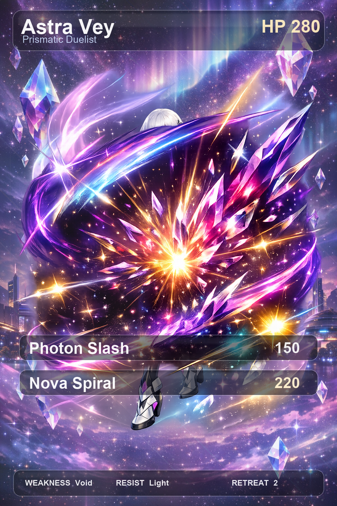

# 4D Card Generator


[](https://iamkuff.github.io/4d-card-generator/)

Generate a **layered anime-style card** as separate PNGs (background, holo, FX, player, UI, gloss), then view them in the browser with **CSS parallax** — each image is its own depth plane, not one baked JPEG.

**Live:** [iamkuff.github.io/4d-card-generator](https://iamkuff.github.io/4d-card-generator/) (hosted from [`docs/`](docs/)).

<p align="center">
  <a href="https://iamkuff.github.io/4d-card-generator/">
    
  </a>
</p>

Uses OpenAI (`gpt-5.4` for planning, `gpt-image-1.5` for images). Set `OPENAI_API_KEY` (see `.env.example`). Never commit keys.

---

## Quick start

```bash
git clone https://github.com/iamKuff/4d-card-generator.git
cd 4d-card-generator
python -m venv .venv
source .venv/bin/activate          # Windows: .\.venv\Scripts\Activate.ps1
pip install -r requirements.txt
export OPENAI_API_KEY="your_key"   # Windows: $env:OPENAI_API_KEY="..."
python generate_card.py
```

With a custom card:

```bash
python generate_card.py --config examples/sample_config.json
```

Outputs go to `output_card/` (gitignored). Useful flags: `--output <dir>`, `--overwrite`, `--viewer-only` (rebuild HTML/manifests), `--rebuild-overlays` (UI/holo/gloss from existing PNGs, no API).

---

## What you get

| | |
|--|--|
| **AI layers** | `character_reference.png`, `background.png`, `player.png`, `fx_back.png`, `fx_front.png` |
| **Local overlays** | `ui_overlay.png`, `holo_overlay.png`, `gloss_overlay.png` (Pillow) |
| **Preview** | `preview_composite.png` — flat check only; the **viewer** uses individual PNGs |
| **Viewer** | `viewer.html` + `manifest.json`, `scene_manifest.json`, `style_bible.json` |

Layer order (back → front): background → holo → fx_back → player → fx_front → ui → gloss. Tune depths in your JSON under `viewer_depths`.

---

## GitHub Pages

The demo site is built from **`docs/`** (`index.html` + card assets in `docs/demo/`). To refresh it after a local run, copy `output_card/*` → `docs/demo/`, commit, push. Repo **Settings → Pages**: branch `main`, folder **`/docs`**.

---

## Troubleshooting

- **Viewer images blank locally** — serve the folder (`python -m http.server` inside `output_card/`) instead of opening `file://` URLs.
- **API errors** — ensure `OPENAI_API_KEY` is set in the environment (optional: `.env` in project root; `python-dotenv` loads it).

## License

MIT — see `LICENSE`.
